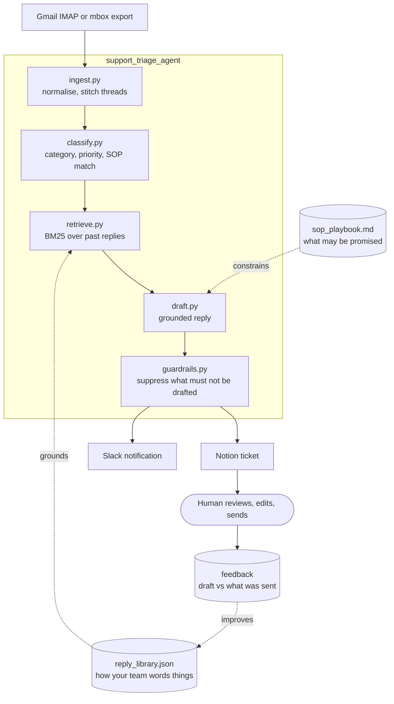

# support-triage-agent


Turns an inbound support inbox into review-ready tickets. Each email gets
classified, prioritised, matched against how your team has answered similar
questions before, and written up as a draft reply that a human approves or
rewrites before anything is sent.

Nothing goes to a customer automatically. That is the design, not a limitation.

Worked examples of what it drafts, and what a reviewer would send instead, are
in [`docs/BEFORE_AFTER.md`](docs/BEFORE_AFTER.md).

## Why retrieval and not just a prompt

An LLM asked to "write a support reply" invents policy. It will confidently
promise a 24-hour refund because that sounds like a reasonable thing to say.

So drafts are grounded in two things instead:

- **The reply library** (`data/reply_library.json`), built from your own
  resolved tickets, constrains *how* things are worded.
- **The SOP playbook** (`data/sop_playbook.md`), written by whoever owns support
  policy, constrains *what* may be promised.

Retrieval is BM25 over the *customer emails* of past (email -> reply) pairs,
returning the paired replies as grounding. Indexing the questions rather than
the answers is the point: a new email resembles the old question, not the old
reply. Deliberately not embeddings — support questions repeat almost verbatim,
lexical matching is strong on exactly that, and it stays inspectable. You can
see which past reply drove a draft, which matters when a draft is wrong and you
need to know why.

## The human-in-the-loop part

Every draft lands in Notion for review, with a Slack notification. The agent
never touches the mail server's send path.

`guardrails.py` decides what must not be drafted at all. Anything mentioning
legal action, a regulator, a chargeback or self-harm is routed straight to a
person with no draft attached, because a plausible draft on those is worse than
no draft: it anchors the reviewer.

Naming a colleague does the same, but only once you list them: `EMPLOYEE_NAMES`
is empty by default, since the guard cannot know who your colleagues are.

The store has a `feedback` table for recording an agent draft alongside what the
human actually sent. That delta is the signal worth having: it is the honest
measure of whether the thing works.

Be clear about what ships, though: only `backfill_feedback.py` writes to it, and
it stores an empty draft for historical mail because no draft existed at the
time. Capturing the live delta means writing back what the reviewer sent after
they edit a ticket, and that hook does not exist yet. The table and the schema
are here; the loop is not closed.

## Architecture



The agent stops at the Notion ticket. It has no path to the mail server's send
route, so "accidentally emailed a customer" is not a failure mode it can have.

## Setup

```bash
pip install -e .
cp .env.example .env      # Anthropic, Notion, Slack, IMAP credentials
```

### See retrieval do something first

The committed `data/reply_library.json` holds four replies. It shows the schema,
and BM25 over four documents returns the same document every time, so the part
of the design worth looking at is invisible.

Build a real one from a public dataset instead:

```bash
python scripts/fetch_public_replies.py --out data/reply_library.public.json
REPLY_LIBRARY=data/reply_library.public.json python -m support_triage_agent.pipeline
```

That is 400 synthetic replies across ten categories, fetched in about two
seconds, and it leaves the committed example alone.

The data is Bitext's customer-support dataset. **Synthetic**, deliberately:
pointing a support-mail tool at other people's real complaints would contradict
everything below about handling this kind of data. Note the licence is
**CDLA-Sharing-1.0**, not MIT, so the generated file is gitignored rather than
committed here. Publishing a derivative of it means publishing under those
terms.

### Running it without an inbox

There is a generated mailbox in the repo, so the whole pipeline can be run from
a clean clone with no inbox, no Notion and no Slack:

```bash
python scripts/demo.py
```

It writes a synthetic Gmail-Takeout `.mbox`, extracts it, ingests it, triages
it, and checks the result.

For real drafts with no Anthropic account, point it at a local model. The
`openai` transport speaks `/v1/chat/completions`, which Ollama, vLLM, LM Studio,
llama.cpp and OpenRouter all serve:

```bash
ollama serve && ollama pull gemma3:4b
LLM_TRANSPORT=openai OPENAI_MODEL=gemma3:4b python scripts/demo.py
```

That matters beyond convenience. This tool reads customer mail, so sending it to
a hosted API should be a decision somebody makes rather than a default they
inherit. With neither transport configured a mock model runs and everything
except the wording still happens.

```
--- which messages become tickets ---------------------------------
  Asha Rao <<email>>                     Paid 499 but no credits showing
  Asha Rao <<email>>                     App crashes when I open the chat
  Ben Ortiz <<email>>                    Cannot change my registered email
  Dana Iqbal <<email>>                   Booking page will not load
  Eli Novak <<email>>                    Wrong provider joined my session and I want
  Farah Massi <<email>>                  Speaking to my solicitor about this
  Gita Sharma <<email>>                  Raising a chargeback with my bank
  Hana Petrov <<email>>                  I feel awful about all of this
  Ben Ortiz <<email>>                    Refund for duplicate charge

  PASS  the newsletter was dropped (List-Unsubscribe)
  PASS  the bounce was dropped (no-reply sender)
  PASS  mail not addressed to support was dropped
  PASS  nine conversations from fourteen messages
  PASS  two messages a day apart became ONE conversation
  PASS  her later message became a SEPARATE ticket, because we had replied in between
  PASS  two messages 38 days apart stayed separate (7-day window)

--- triage + guardrails -------------------------------------------
  Speaking to my solicitor about this        human=True draft=withheld
      Mentions legal action - routed to a human with no draft attached.
  Raising a chargeback with my bank          human=True draft=withheld
      Mentions chargeback - routed to a human with no draft attached.
  I feel awful about all of this             human=True draft=withheld
      Mentions self-harm - routed to a human with no draft attached.

  model calls for 9 conversations: 15
  PASS  no draft was generated for a message that cannot carry one

--- the cache -----------------------------------------------------
  first pass: 15 model calls. second pass: 0 model calls, 9 cache hits.

30 of 30 checks passed
```

**Every message above is invented.** The addresses are RFC 2606 reserved
domains, the phone number is in the 555 range, and `scripts/mock_mailbox.py`
holds the whole mailbox in one readable list.

What the 30 checks assert is deliberately the part that does **not** depend on
the model: which messages become tickets, how consecutive messages are stitched
into one conversation, what the regexes extract, when a draft is withheld, and
whether a second run pays for the first one again. Those are decisions made in
code, so a good model cannot rescue them and a bad one cannot break them.

Draft *quality* is not checked, and the script does not pretend to. That needs a
judge, a key and a rubric, and it would not reproduce from a clean clone.

Two things came out of running it that the 96 unit tests did not:

- 15 model calls for 9 conversations, not 18. Suppression depends only on what
  the customer wrote, so it is now decided **before** drafting. The old order
  generated a reply to a self-harm message and then discarded it: a wasted call,
  and wording nobody should ever have read.
- The three suppressed drafts are empty rather than merely flagged, which is
  what the section above promises and is now asserted rather than described.

### Backfill from your own mail

Backfill a reply library from your own resolved mail:

```bash
python -m support_triage_agent.mbox_extract --mbox /path/to/your/export.mbox
python -m support_triage_agent.build_reply_library
```

Then run the pipeline:

```bash
python -m support_triage_agent.pipeline
```

Docker Compose is provided for a scheduled deployment.

## About the data files

`data/reply_library.json` and `data/sop_playbook.md` here are **synthetic
examples**. They show the schema and let the tests run.

Real versions are built from your own support history, and they are the reason
`.gitignore` blocks `data/*.db`, `data/*.jsonl*` and `data/*.mbox` by pattern.

Take that seriously. A support mailbox is one of the most sensitive datasets a
consumer company holds: it pairs customer contact details with the full text of
their complaints, disputes and account problems. It should not leave your
controlled environment, it should not sit on a laptop, and it should never reach
a repository, public or private. Build the library where the data already lives,
and commit only the derived, de-identified artefact.

`build_reply_library` strips phone numbers and email addresses from reply text.
Verify that on your own data before trusting it; a redactor is only as good as
the identifier formats it knows about.

## What it does not do

Worth knowing before you adopt it:

- **No sending.** There is no send path, by design. If you want auto-send for a
  narrow category, that is a change you make deliberately, after measuring
  draft acceptance on your own mail.
- **Retrieval is lexical, not semantic.** BM25 matches wording, so a question
  asked in genuinely novel phrasing retrieves poorly. This is the right trade
  for support mail, where questions repeat almost verbatim, and the wrong one
  for open-ended queries.
- **Quality is bounded by your SOPs.** With no matching SOP the agent writes a
  bare acknowledgement rather than improvising. A thin playbook produces thin
  drafts, and that is the intended behaviour.
- **Guardrails are keyword-based.** `guardrails.py` catches the categories it
  knows about. It will not catch every sensitive message, so it reduces risk
  rather than removing it.
- **English-centric.** Classification and retrieval are tuned for English and
  romanised mixed-script mail. Other languages need their own vocabulary.
- **Not multi-tenant.** One inbox, one SOP set, one SQLite store.

## Tests

```bash
pytest
```

Covers classification, categorisation, thread stitching, retrieval ranking,
reply-library cleaning, the guardrails and the store layer.

`pytest` does not run the end-to-end demo above. Run that separately with
`python scripts/demo.py`; it exits non-zero if any check fails.

## Contributing

Bug reports and pull requests are welcome. [CONTRIBUTING.md](CONTRIBUTING.md)
covers the setup and the gate that must be green before a PR. Everyone taking
part is expected to follow the [Code of Conduct](CODE_OF_CONDUCT.md).

For a security problem, do not open an issue: see [SECURITY.md](SECURITY.md).

## License

MIT. See [LICENSE](LICENSE).
